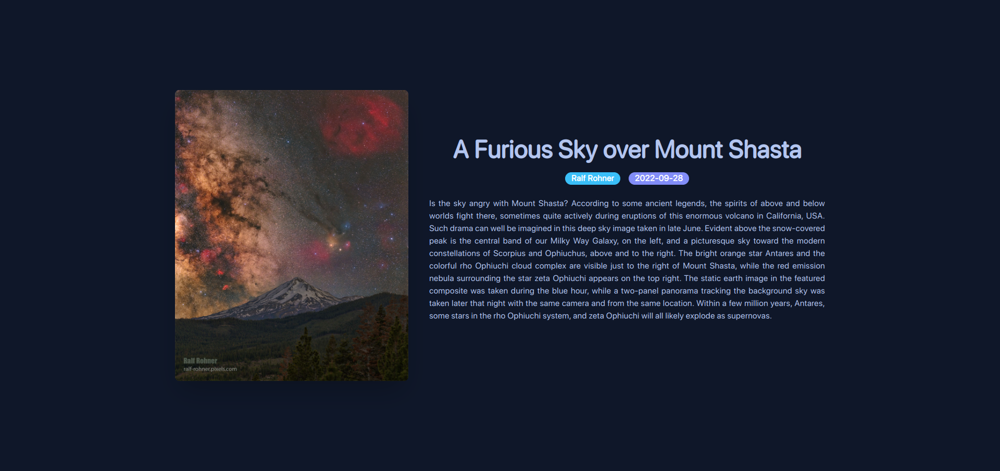

# Welcome to Nasa API project - with [Astro](https://astro.build)

> 🧑‍🚀 **Seasoned astronaut**



## ⚡ My processes

1. I started by creating the files and folders I would use and starting my repository setup.

2. Then look for the API that is in: [{ NASA APIs }](https://api.nasa.gov/), since you enter they only ask you; your name and surname and your email. Since you give it to them, they return your key.

3. After doing tests with the API and since I knew what I would do, start with the components that will have the API parameters.

4. To conclude, I made the styles with SASS/SCSS because it is faster for me (It should be noted that if you want to use native CSS there is no problem).

## 🔥 What I learned

1. I reinforced what I knew about how to consume an API and print it on the screen.

2. How to use astro and change a project from scratch.

## 🚀 Project Structure

Inside of your Astro project, you'll see the following folders and files:

```
/
├── public/
│   └── favicon.ico
├── src/
│   ├── layouts/
│   │   └── Layout.astro
│   └── pages/
│       ├── index.astro
│       └── global.css
└── package.json
```

Astro looks for `.astro`, `.md` or `.css` files in the `src/pages/` directory. Each page is exposed as a route based on its file name.

There's nothing special about `src/components/`, but that's where we like to put any Astro/React/Vue/Svelte/Preact components.

Any static assets, like images, can be placed in the `public/` directory.

## 🧞 Commands

All commands are run from the root of the project, from a terminal or powershell:

| Command                | Action                                             |
| :--------------------- | :------------------------------------------------- |
| `npm install`          | Installs dependencies                              |
| `npm run dev`          | Starts local dev server at `localhost:3000`        |
| `npm run build`        | Build your production site to `./dist/`            |
| `npm run preview`      | Preview your build locally, before deploying       |
| `npm run astro ...`    | Run CLI commands like `astro add`, `astro preview` |
| `npm run astro --help` | Get help using the Astro CLI                       |

## 👀 Want to learn more?

Feel free to check [our documentation](https://docs.astro.build) or jump into our [Discord server](https://astro.build/chat).

## 💬 Social

- Twitter: [@YeiserJiménez2](https://twitter.com/YeiserJimnez2)

- Instagram: [@yeisel_heriel](https://www.instagram.com/yeisel_heriel/)